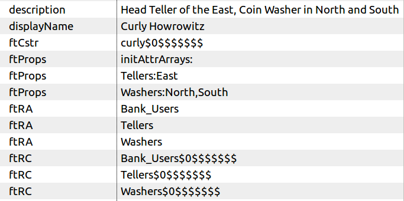

# Overview of the rbac-abac-sample README

 * This document demonstrates how to build and deploy the fortress rbac with abac sample.
 * The intent is to demonstrate using attributes to control role activation within an Apache Wicket Web app.
 * For more info about the idea: [Towards an Attribute-Based Role-Based Access Control System](https://iamfortress.net/2018/07/07/towards-an-attribute-based-role-based-access-control-system/)

-------------------------------------------------------------------------------
## Table of Contents
 * SECTION 1. Prerequisites
 * SECTION 2. Prepare rbac-abac-sample package
 * SECTION 3. Prepare Tomcat for Java EE Security
 * SECTION 4. Build and deploy rbac-abac-sample
 * SECTION 5. Understand the security policy
 * SECTION 6. Manually Test the RBAC with ABAC sample
 * SECTION 7. Automatically Test the RBAC with ABAC sample (using Selenium)
 * SECTION 8. Under the Covers

-------------------------------------------------------------------------------
## SECTION I. Prerequisites
1. Java 8
2. Apache Maven 3++
3. Apache Tomcat 7++
4. Basic LDAP server setup by completing either Quickstart
    * [OpenLDAP & Fortress QUICKSTART on DOCKER](https://github.com/apache/directory-fortress-core/blob/master/README-QUICKSTART-DOCKER-SLAPD.md)
    * [APACHEDS & Fortress QUICKSTART on DOCKER](https://github.com/apache/directory-fortress-core/blob/master/README-QUICKSTART-DOCKER-APACHEDS.md)

-------------------------------------------------------------------------------
## SECTION II. Prepare rbac-abac-sample package

#### 1. Stage the project.

 a. Download and extract from Github:

 ```bash
 wget https://github.com/shawnmckinney/rbac-abac-sample/archive/master.zip
 ```

 Or

 b. Or 'git clone' locally:

 ```git
 git clone https://github.com/shawnmckinney/rbac-abac-sample.git
 ```

#### 2. Change directory into it:

 ```bash
 cd rbac-abac-sample
 ```

#### 3. Enable an LDAP server:

 ```bash
 cp src/main/resources/fortress.properties.example to fortress.properties
 ```

 Pick either Apache Directory or OpenLDAP server:

 a. Prepare fortress for apacheds usage:

 ```properties
 # This param tells fortress what type of ldap server in use:
 ldap.server.type=apacheds

 # Use value from [Set Hostname Entry]:
 host=localhost

 # ApacheDS defaults to this:
 port=10389

 # These credentials are used for read/write access to all nodes under suffix:
 admin.user=uid=admin,ou=system
 admin.pw=secret

 # This is min/max settings for LDAP administrator pool connections that have read/write access to all nodes under suffix:
 min.admin.conn=1
 max.admin.conn=10

 # This node contains fortress properties stored on behalf of connecting LDAP clients:
 config.realm=DEFAULT
 config.root=ou=Config,dc=example,dc=com

 # Used by application security components:
 perms.cached=true

 # Fortress uses a cache:
 ehcache.config.file=ehcache.xml
 ```

 b. Prepare fortress for openldap usage:

 ```properties
 # This param tells fortress what type of ldap server in use:
 ldap.server.type=openldap

 # Use value from [Set Hostname Entry]:
 host=localhost

 # OpenLDAP defaults to this:
 port=389

 # These credentials are used for read/write access to all nodes under suffix:
 admin.user=cn=Manager,dc=example,dc=com
 admin.pw=secret

 # This is min/max settings for LDAP administrator pool connections that have read/write access to all nodes under suffix:
 min.admin.conn=1
 max.admin.conn=10

 # This node contains fortress properties stored on behalf of connecting LDAP clients:
 config.realm=DEFAULT
 config.root=ou=Config,dc=example,dc=com

 # Used by application security components:
 perms.cached=true

 # Fortress uses a cache:
 ehcache.config.file=ehcache.xml
 ```

-------------------------------------------------------------------------------
## SECTION III. Prepare Tomcat for Java EE Security

This sample web app uses Java EE security.

#### 1. Download the fortress realm proxy jar into tomcat/lib folder:

  ```bash
  wget http://repo.maven.apache.org/maven2/org/apache/directory/fortress/fortress-realm-proxy/2.0.1/fortress-realm-proxy-2.0.1.jar -P $TOMCAT_HOME/lib
  ```

  where *TOMCAT_HOME* matches your target env.

#### 2. Prepare tomcat to allow autodeploy of rbac-abac-sample web app:

 ```bash
 sudo vi /usr/local/tomcat8/conf/tomcat-users.xml
 ```

#### 3. Add tomcat user to deploy rbac-abac-sample:

 ```xml
 <role rolename="manager-script"/>
 <role rolename="manager-gui"/>
 <user username="tcmanager" password="m@nager123" roles="manager-script"/>
 ```

#### 4. Restart tomcat for new settings to take effect.

 Note: The proxy is a shim that uses a [URLClassLoader](http://docs.oracle.com/javase/7/docs/api/java/net/URLClassLoader.html) to reach its implementation libs.  It prevents
 the realm impl libs, pulled in as dependency to web app, from interfering with the container’s system classpath thus providing an error free deployment process free from
 classloader issues.  The proxy offers the flexibility for each web app to determine its own version/type of security realm to use, satisfying a variety of requirements
 related to web hosting and multitenancy.

-------------------------------------------------------------------------------
## SECTION IV. Build and deploy rbac-abac-sample

#### 1. Set java and maven home env variables.

#### 2. Run this command from the root package:


 Tomcat auto-deploy options in [pom.xml](pom.xml) file.
 ```xml
 <plugin>
     <groupId>org.codehaus.mojo</groupId>
     <artifactId>tomcat-maven-plugin</artifactId>
     <version>1.0-beta-1</version>
     <configuration>
     ...
         <url>http://localhost:8080/manager/text</url>
         <path>/${project.artifactId}</path>
         <!-- Warning the tomcat manager creds here are for deploying into a demo environment only. -->
         <username>tcmanager</username>
         <password>m@nager123</password>
     </configuration>
 </plugin>
 ```

  a. Automatically deploy to tomcat server:

  ```maven
 mvn clean tomcat:deploy -Dload.file
  ```

  b. Or to redeploy:

  ```maven
 mvn clean tomcat:redeploy -Dload.file
  ```

  c. '-Dload.file' automatically loads the [rbac-abac-sample security policy](src/main/resources/rbac-abac-sample-security-policy.xml) data into ldap.
  This load needs to happen just once for the default test cases to work and may be dropped from future 'mvn' commands.

  Or if something changes in the policy, it may be run as a separate operation:

  ```maven
 mvn clean -Dload.file
  ```

 d. This web app may be manually deployed to Tomcat.

 ```bash
 cp target/rbac-abac-sample.war $TOMCAT_HOME/webapps
 ```

-------------------------------------------------------------------------------
## SECTION V. Understand the security policy

To gain full understanding, check out the file used to load it into the LDAP directory: [rbac-abac-sample security policy](src/main/resources/rbac-abac-sample-security-policy.xml).

App comprised of three pages, each has buttons and links that are guarded by permissions.  The permissions are granted to a particular user via their role activations.

#### 1. User-to-Role Assignment Table

 For this app, user-to-role assignments are:

| user       | Tellers     | Washers  |
| ---------- | ----------- | -------- |
| curly      | true        | true     |
| moe        | true        | true     |
| larry      | true        | true     |

#### 2. User-to-Role Activation Table by Branch

 But we want to control role activation using attributes based on Branch location:

| user       | Tellers   | Washers       |
| ---------- | --------- | ------------- |
| curly      | East      | North, South  |
| moe        | North     | East, South   |
| larry      | South     | North, East   |

 *Even though the test users are assigned both roles, they are limited which can be activated by branch.*

#### 3. Role-to-Role Dynamic Separation of Duty Constraint Table

 Furthermore due to toxic combination, we must never let a user activate both roles simultaneously regardless of location. For that, we'll use a dynamic separation of duty policy.

| set name      | Set Members   | Cardinality   |
| ------------- | ------------- | ------------- |
| Bank Safe     | Washers       | 2             |
|               | Tellers       |               |
|               |               |               |

#### 4. Role-Permission Table Links

 The page links are guarded by RBAC permissions that dependent on which roles are active in the session.

| role       | WashersPage | TellersPage |
| ---------- | ----------- | ----------- |
| Tellers    | false       | true        |
| Washers    | true        | false       |

#### 5. Role-Permission Table Buttons

 The buttons on the page are also guarded by RBAC permissions.

| role       | Account.deposit | Account.withdrawal | Account.inquiry  | Currency.soak | Currency.rise | Currency.dry |
| ---------- | --------------- | ------------------ | ---------------- | ------------- | ------------- | ------------ |
| Tellers    | true            | true               | true             | false         | false         | false        |
| Washers    | false           | false              | false            | true          | true          | true         |

-------------------------------------------------------------------------------
## SECTION VI. Manually Test the RBAC with ABAC sample

#### 1. Open link to [http://localhost:8080/rbac-abac-sample](http://localhost:8080/rbac-abac-sample)

#### 2. Login with Java EE authentication form:

#### 3. User-Password Table

 | userId        | Password      |
 | ------------- | ------------- |
 | curly         | password      |
 | moe           | password      |
 | larry         | password      |

#### 4. Enter a location for user and click on the button.

 ```
 Enter North, South or East
 ```

 

#### 5. Once the location is set, a link will appear corresponding with the user's allowed role for that location.

 

#### 6. Click on the link, and then buttons appear simulating user access for that particular location.

 

#### 7. Change locations, and a different link appears, with different operations.

 This is RBAC with ABAC in action, limiting which role may be activated in the session by location.

#### 8. Try a different user.

 Each has different access rights to application.

## SECTION VII. Automatically Test the RBAC with ABAC sample

 Run the selenium automated test:

 ```maven
 mvn test -Dtest=RbacAbacSampleSeleniumITCase
 ```

 Selenium Test Notes:
 * *This test will log in as each user, perform positive and negative test cases.*
 * *Requires Firefox on target machine.*


-------------------------------------------------------------------------------
## SECTION VIII. Under the Covers

 How does this work?  Have a look at some code...

 Excerpt from :

 ```java
  Properties props = new Properties(  );
  props.setProperty( "locale", branchId );
  User user = new User(userId);
  user.addProperties( props );
  Session session = null;
  try
  {
      session = accessMgr.createSession( user, true );
  }
  catch (SecurityException se)
  {
      // log or throw
  }
 ```

 Pushing the **locale** attribute into the User's RBAC session the runtime will match that instance data with their stored policy.

 

 * *Notice that this user has been assigned both Teller and Washer, via **ftRA** attribute, and that another attribute, **ftProps**, constrains where it can be activated.*
 * *This works with any kind of instance data, e.g. account, organization, etc.*
